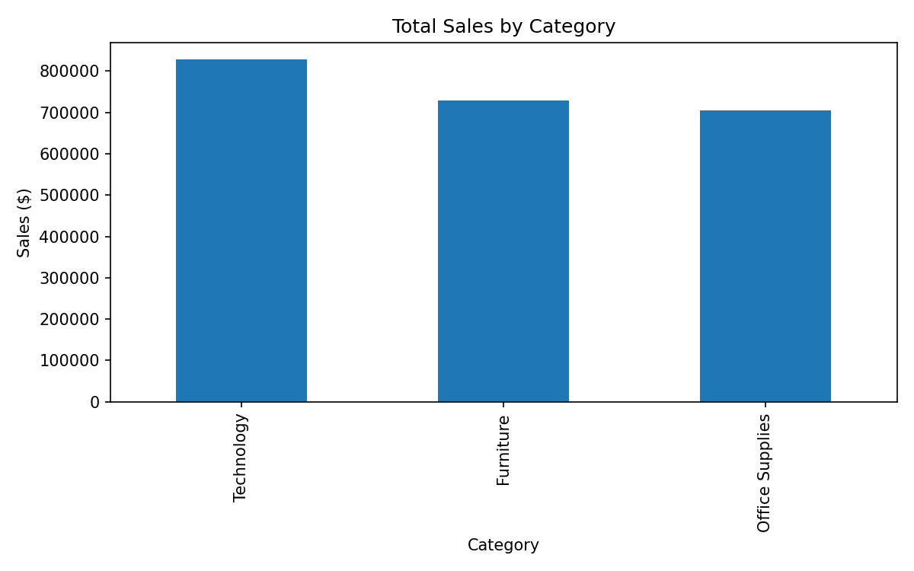
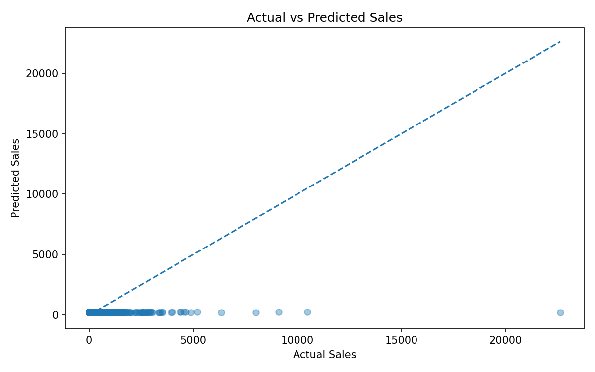

# 📊 Sales Data Analysis & Prediction

Supervised machine learning project analyzing retail sales data 
to uncover business insights and build a predictive model for 
revenue forecasting.

---

## 🎯 Objective

Analyze sales patterns across product categories and build a 
Linear Regression model to predict sales — translating raw 
retail data into actionable insights to support data-driven business decisions.

---

## 📁 Dataset

- **Source:** Superstore Sales Dataset  
- **Size:** 9,994 records, 21 features  
- **Key columns:** Category, Sub-Category, Sales, Quantity, Discount, Profit  

---

## 🧠 Methodology

1. **Data Loading & Cleaning** — handle nulls, inspect structure  
2. **Exploratory Data Analysis** — sales by category, discount impact  
3. **Visualization** — bar charts, scatter plots, top sub-categories  
4. **Feature Engineering** — encode categorical variables and apply feature scaling  
5. **Model Training** — Linear Regression (train/test split 80/20)  
6. **Evaluation** — R² Score, MSE, RMSE, Actual vs Predicted plot  

---

## ⚙️ Technical Highlights

- Implemented one-hot encoding for categorical variables  
- Applied feature scaling to improve model performance  
- Evaluated model using R², MSE, and RMSE metrics  
- Visualized model performance using Actual vs Predicted plot  

---

## 📈 Key Insights

- Technology generates the highest total revenue among all categories  
- High discounts do not consistently lead to higher sales  
- A small number of sub-categories drive the majority of revenue  

---

## 🤖 Model Results

| Metric | Value |
|---|---|
| R² Score | ~0.08 |
| RMSE | Dataset-dependent |
| Features used | Quantity, Discount, Category |

> The model serves as a baseline. Performance can be improved 
> with additional features (e.g. region, seasonality) or 
> ensemble models like Random Forest.

---

## 📊 Visual Results

### Sales by Category


### Sales vs Discount


### Actual vs Predicted


---

## 💡 Business Value

- Identified top-performing categories to prioritize inventory  
- Revealed that discount strategy needs review — high discounts 
  don't drive proportional sales growth  
- Predictive baseline established for future revenue forecasting  
- Supports strategic pricing and inventory decisions through data analysis  

---

## 🛠 Tools & Libraries

| Tool | Purpose |
|---|---|
| Python | Core language |
| Pandas | Data manipulation |
| Scikit-learn | Machine learning |
| Matplotlib | Visualization |

---

## 🚀 How to Run

```bash
pip install pandas scikit-learn matplotlib
python analysis.py
python model.py
