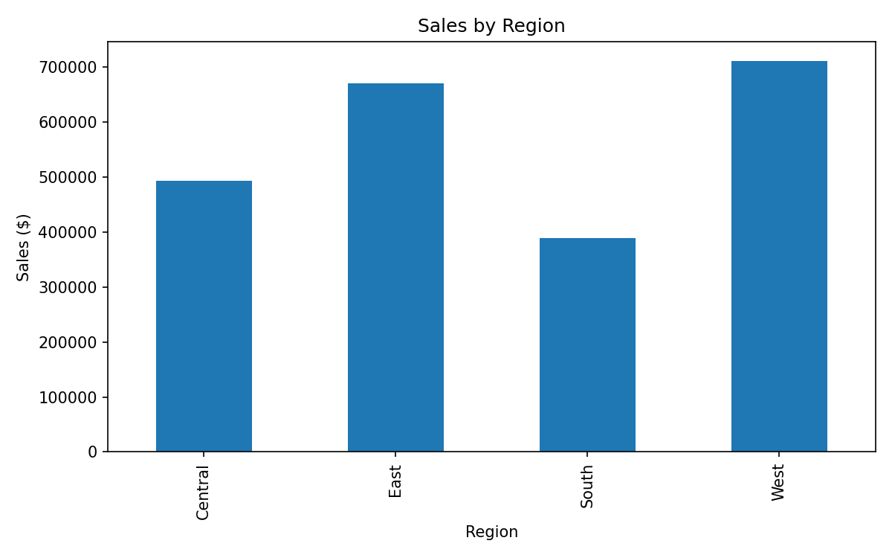
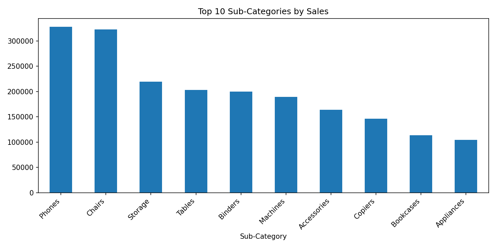
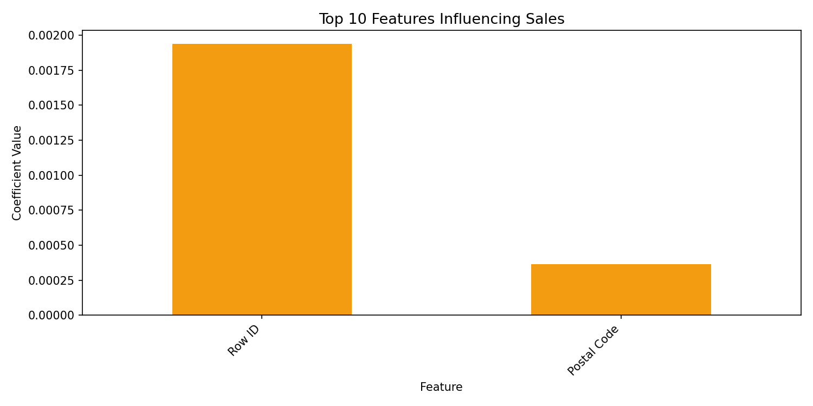

# 📊 Sales Data Analysis & Prediction

Supervised machine learning project analyzing retail sales data
to uncover business insights and build a predictive model for
revenue forecasting.

---

## 🎯 Objective

Analyze sales patterns across product categories, regions, and
sub-categories, then build a Linear Regression model to predict
sales — translating raw retail data into actionable insights to
support data-driven business decisions.

---

## 📁 Dataset

- **Source:** Superstore Sales Dataset
- **Size:** 9,800 records, 18 features
- **Key columns:** Category, Sub-Category, Sales, Region, Segment

---

## 🧠 Methodology

1. **Data Loading & Cleaning** — strip column names, handle nulls
2. **Exploratory Data Analysis** — sales by category, region, sub-category
3. **Visualization** — bar charts with value labels, top sub-categories
4. **Feature Engineering** — one-hot encoding of categorical variables
5. **Model Training** — Linear Regression (train/test split 80/20)
6. **Evaluation** — R² Score, MSE, RMSE, Actual vs Predicted plot
7. **Feature Importance** — top 10 coefficients driving sales predictions

---

## ⚙️ Technical Highlights

- Applied one-hot encoding (pd.get_dummies) for categorical variables
- Selected only numeric features for model training
- Evaluated model using R², MSE, and RMSE metrics
- Visualized feature coefficients to identify key sales drivers
- Actual vs Predicted plot to assess model performance visually

---

## 📈 Key Insights

- Technology generates the highest total revenue among all categories
- West and East regions outperform Central and South significantly
- Phones and Chairs are the top revenue-generating sub-categories
- A small number of sub-categories drive the majority of total revenue

---

## 🤖 Model Results

| Metric | Value |
|---|---|
| R² Score | ~0.08 |
| MSE | Dataset-dependent |
| RMSE | Dataset-dependent |
| Features used | Category, Sub-Category, Region |

> The model serves as a baseline. Performance can be improved
> with additional features (e.g. quantity, discount, seasonality)
> or ensemble models like Random Forest.

---

## 📊 Visual Results

### Sales by Category


### Sales by Region


### Top 10 Sub-Categories


### Actual vs Predicted Sales


### Feature Importance


---

## 💡 Business Value

- Identified top-performing categories to prioritize inventory planning
- Regional analysis reveals market opportunities in underperforming areas
- Feature importance highlights which product categories drive revenue most
- Predictive baseline established for future sales forecasting improvements
- Supports strategic pricing and inventory decisions through data analysis

---

## 🛠 Tools & Libraries

| Tool | Purpose |
|---|---|
| Python | Core language |
| Pandas | Data manipulation |
| Scikit-learn | Machine learning & encoding |
| Matplotlib | Visualization |

---

## 🚀 How to Run

```bash
pip install pandas scikit-learn matplotlib
python analysis.py
python model.py
```

---

## 👤 Author

Maher Zouari — [github.com/maherzouari0](https://github.com/maherzouari0)
